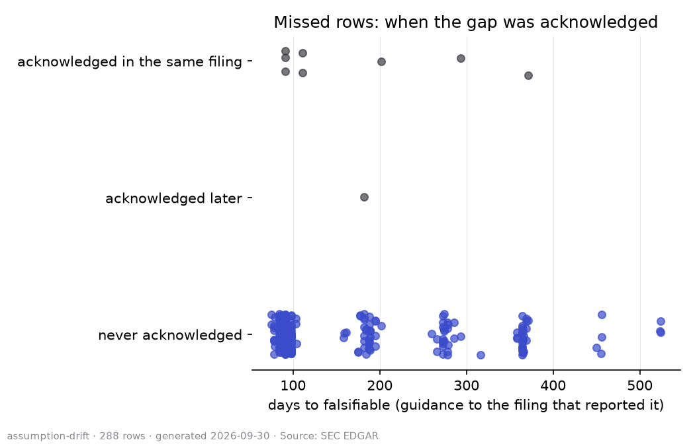
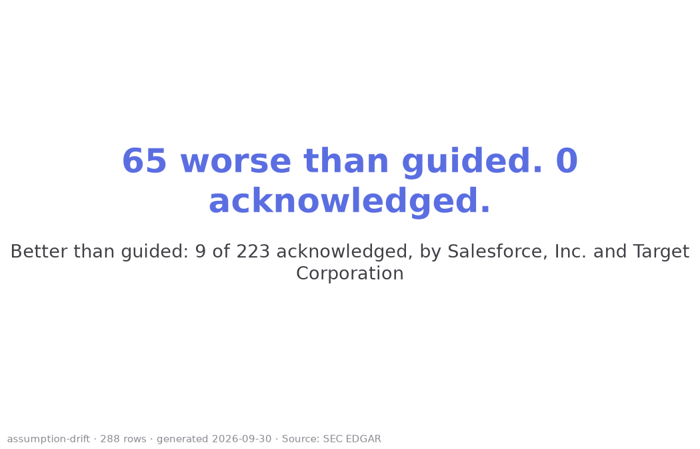
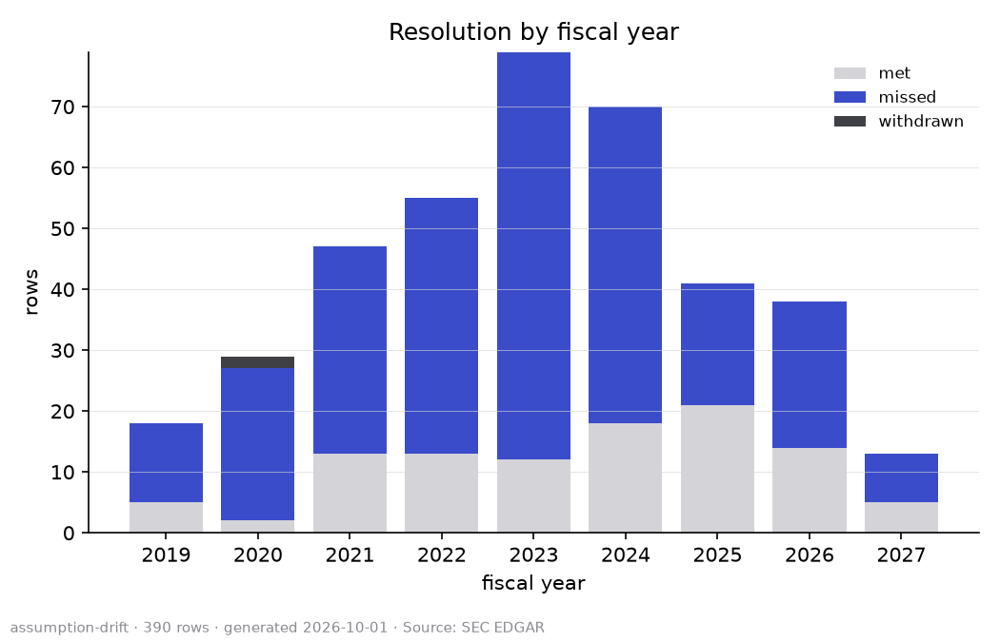
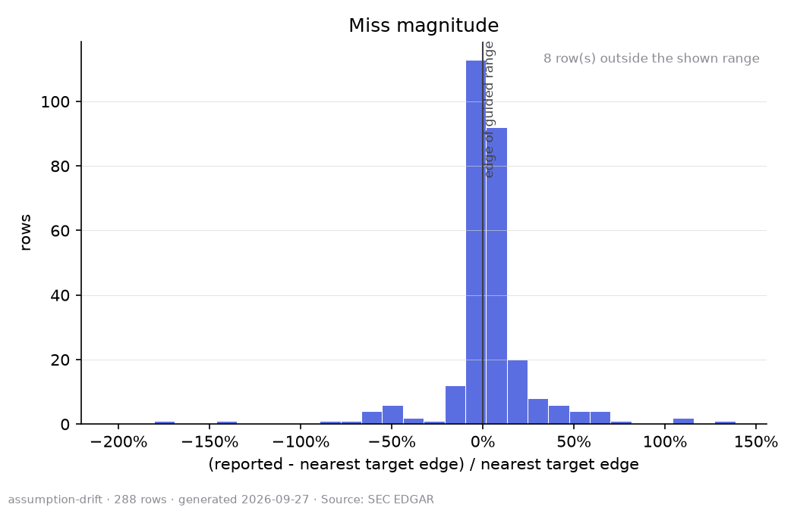

# assumption-drift

## What this is

Adobe Inc., Advanced Micro Devices, Inc., Amazon.com, Inc., Broadcom Inc., Lowe's Companies, Inc., Meta Platforms, Inc., Microsoft Corporation, NVIDIA Corporation, QUALCOMM Incorporated, Salesforce, Inc., Target Corporation and The Home Depot, Inc. made numeric forward guidance statements in their own SEC filings, filed between
January 2019 and September 2026. This dataset pairs each one with what the company later reported for that same metric
and period, and records whether the company ever acknowledged the gap when the guidance was missed.
It is a problem statement in data form, not a model and not a demonstration of one.
Apple Inc., Alphabet Inc., Costco Wholesale Corporation, JPMorgan Chase & Co. and Micron Technology, Inc. were in the company list but issued no numeric guidance the metric list covers, so they have no rows here.

## How a row is built

A row starts as a sentence or a table in an 8-K, 10-K or 10-Q filing that names a metric, a number or
range, and a period. A later filing reporting the same metric for the same period supplies the outcome,
when one exists. Every candidate row was drafted by a language model reading the filing text.

## The resolution rubric

A row resolves mechanically from its own numbers, once the period has closed and an outcome exists:

- **met**: the reported value falls inside the guided range, endpoints included (a single point value
  is met within half a percent of itself)
- **missed**: the reported value falls outside the guided range, on the good side of it (better than
  guided) or the bad side (worse than guided). Which side is good depends on the metric. Higher is better
  for revenue, gross margin, operating margin, operating income, EPS, other income and expense, comparable sales and free cash flow. Lower is better for operating expenses, tax rate, total expenses and capital expenditures
- **withdrawn**: the company explicitly withdrew or suspended the guidance in a later filing, before
  the period closed
- **unresolved**: the period has not closed yet, or no later filing reports the metric

Acknowledged means a later 8-K, 10-K or 10-Q states the gap in so many words, naming which side of its
guidance the result fell on: for example "below", "short of", "did not meet", "higher than expected",
"exceeded" or "above the high end".

As of 2026-10-06, the release holds **1,046 rows**: 213 met, 406 missed, 424 unresolved, 3 withdrawn.
Of the misses, 314 were better than guided and 92 worse than guided; median days from the guidance to the
filing that made it checkable was 92, and
98% of misses were never acknowledged in a later filing.

By company:

| company | rows | met | missed | withdrawn | unresolved | never-acknowledged share |
| --- | --- | --- | --- | --- | --- | --- |
| Adobe Inc. | 8 | 0 | 0 | 0 | 8 | n/a |
| Advanced Micro Devices, Inc. | 95 | 36 | 19 | 0 | 40 | 100% |
| Amazon.com, Inc. | 30 | 10 | 18 | 0 | 2 | 100% |
| Broadcom Inc. | 37 | 10 | 16 | 1 | 10 | 100% |
| Lowe's Companies, Inc. | 75 | 0 | 3 | 0 | 72 | 100% |
| Meta Platforms, Inc. | 80 | 37 | 27 | 0 | 16 | 100% |
| Microsoft Corporation | 5 | 0 | 0 | 0 | 5 | n/a |
| NVIDIA Corporation | 212 | 58 | 79 | 0 | 75 | 100% |
| QUALCOMM Incorporated | 52 | 13 | 23 | 0 | 16 | 100% |
| Salesforce, Inc. | 317 | 18 | 168 | 0 | 131 | 99% |
| Target Corporation | 82 | 27 | 38 | 2 | 15 | 79% |
| The Home Depot, Inc. | 53 | 4 | 15 | 0 | 34 | 100% |

## Provenance guarantee

Every `source_url` in this dataset returned a 200 from `www.sec.gov` or `efts.sec.gov`; no row was
built from a URL that was not actually fetched. Every excerpt is the exact text taken from that
filing. Its provenance hash is the sha256 of the extracted text, not of the raw page: SEC serves a
per-request script tag inside the raw HTML that differs on every fetch of the same document, so only
the extracted text is stable enough to hash and check again later. Every row was independently
checked by a person against the cached filing before it was approved, and at least ten percent of the
approved rows for each company were separately re-found on EDGAR by hand, their URL compared to the
one the pipeline used.

## Known limitations

- This covers twelve companies. It is a pilot, not a survey of the market.
- The pipeline does not claim to capture every guidance statement a company ever made; it captures
  the ones its patterns and its model caught.
- A row reported better than guided is recorded as missed, the same as one reported worse, because the
  guided range was wrong either way. Which side it fell on is reported separately, not folded into the
  status. Whether a side is good or bad is fixed once per metric, the same for every company: operating
  expenses and the tax rate are treated as lower-is-better, everything else as higher-is-better.
- A one-sided floor ("at least X") resolves as met on any reported value above the floor. There is no
  ceiling to measure against, so a floor's better-than-guided rows are not measured; only values below
  it can be missed.
- The search for an acknowledgement covers 8-K, 10-K and 10-Q filing text only. A company that only
  addressed a miss on an earnings call, and never wrote it into a filing, is not found: that text is
  not in EDGAR.
- An outcome that would come from a multi-column table whose header could not be confidently matched
  to a period is held back as unresolved rather than guessed at.
- An acknowledgement is a sentence written after the outcome was reported that refers back to the
  guided figure. A revision made while the period was still open, such as 'increased from our prior
  outlook of $60-65 billion', is a new guidance row, not an acknowledgement. A later release will
  record these revisions separately; when it does, the acknowledged counts will change.

## Coverage notes

- Lowe's and Home Depot: most margin and tax rate rows are unresolved because those companies do not
  print the reported figure as a line in the release; it must be derived from two reported lines.
  These will resolve in a later release.
- Qualcomm: guidance from early 2019 to late 2020 is not yet included because of a two-column table
  layout the parser does not read. Coverage starts at Q1 FY2021.
- Adobe: the revenue and EPS targets table is not yet parsed; Adobe rows are non-GAAP operating margin
  only.
- Microsoft: guidance appeared in filing text only from August 2024; earlier guidance was given on
  earnings calls, which are not in EDGAR.
- Broadcom: adjusted EBITDA guidance is not a tracked metric; rows are revenue and, from 2026,
  non-GAAP operating margin.
- Micron is reviewed separately and not in this release.
- Apple, Alphabet, Costco and JPMorgan issue no numeric guidance in filing text.

## How to cite

If you use this dataset, please cite it as:

    Navneet (2026). assumption-drift. https://huggingface.co/datasets/Nav772/assumption-drift. Accessed 2026-10-06.

## Licence

The dataset is released under CC-BY-4.0. The code that built it is released separately under MIT.
